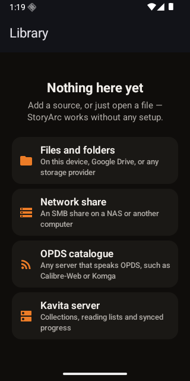

<div align="center">
<br />
<h1>StoryArc</h1>
<p><strong>Native comic, manga and ebook readers for iOS and Android.</strong></p>
<p>
<a href="https://github.com/me-cedric/StoryArc/actions/workflows/contract.yml"></a>
<a href="https://github.com/me-cedric/StoryArc/actions/workflows/ios.yml"></a>
<a href="https://github.com/me-cedric/StoryArc/actions/workflows/android.yml"></a>
<a href="LICENSE"></a>
</p>
<p>
<a href="https://swift.org"></a>
<a href="https://developer.apple.com/ios/"></a>
<a href="https://kotlinlang.org"></a>
<a href="https://developer.android.com"></a>
<a href="https://ko-fi.com/mecedric"></a>
</p>
<br />
</div>

<p align="center">
  
  &nbsp;&nbsp;
  
</p>

StoryArc reads what you already own, from wherever you keep it: a folder on the
device, iCloud Drive or any Files provider, an SMB share on your NAS, an OPDS
catalogue, or a Kavita server. It caches what it finds, downloads what you ask
it to, remembers where you stopped, and syncs that back when the source can hold
it.

Two apps, written twice on purpose. iOS is Swift and SwiftUI with Liquid Glass.
Android is Kotlin and Compose with Material 3 Expressive. **No cross-platform UI
layer, ever** — the point is that each one feels like it shipped with the
operating system.

StoryArc is free and open source, with no paid tier, no accounts and no
telemetry. If it helps you, you can [support development on Ko-fi](https://ko-fi.com/mecedric).

---

## Status

**Pre-alpha.** The foundation is in place; the reader is not. What exists today
is the specification, the design system, and a building, tested app shell on both
platforms.

| Area | State |
| --- | --- |
| Capability specs | ✅ 15 capabilities specified and validating |
| Design system | ✅ OKLCH token source generating Swift + Kotlin, WCAG-gated in CI |
| iOS app shell | ✅ Builds, runs, 33 tests passing, SwiftLint clean |
| Android app shell | ✅ Builds, runs, 22 tests passing, Lint clean (warnings as errors) |
| Domain layer | 🟡 Sources, identity, progress and merge rules implemented and tested on both |
| Format layer | ⬜ CBZ / CBR / CB7 / CBT / EPUB / PDF — specified, not built |
| Source connectors | ⬜ Local, SMB, OPDS, Kavita — specified, not built |
| Readers | ⬜ Paged comic reader and reflowable ebook reader — specified, not built |
| Desktop | 📄 macOS, Windows and Linux documented; no code by design |

Nothing here is installable yet. There are no releases and no signed builds.

## What it will do

**Sources** — Read from a device folder, iCloud Drive or any Files provider, an
SMB share, an OPDS catalogue, or a Kavita server. Every source caches locally,
so the library opens instantly and stays browsable when a server is unreachable.
Offline is a normal state, never an error.

**Formats** — CBZ, CBR, CB7, CBT, EPUB (reflowable and fixed-layout), PDF, and a
plain folder of images. Format is detected from content, not the extension, so a
mis-named file still opens. Metadata comes from `ComicInfo.xml`, the EPUB
package, or the filename — in that order.

**Reading** — A paged image reader with an interactive page curl that follows
your finger, plus slide, fade, and continuous scroll for webtoons. Right-to-left
for manga, detected from metadata. Double-page spreads in landscape. Chrome that
hides itself and never reflows the page. A separate reflowable reader for EPUB
with full typographic control, four AAA-contrast themes, bookmarks, highlights
and read-aloud.

**Library** — One view over every source. Search, filter and sort — respecting a
reading list's curated order rather than forcing it alphabetical. Collections
and reading lists, local or server-backed, presented side by side.

**Offline** — Download a publication, a collection, or a whole reading list.
Resumable, background-capable, Wi-Fi-only if you want it, with visible storage
management and automatic cleanup after finishing.

**Progress** — Recorded locally first, always, and synced with Kavita in both
directions. The same book read from a folder and from a server resolves to one
record. Conflicts resolve to the furthest position, and finished stays finished.

**Everywhere** — English, French, German and Spanish, following your system by
default. System / Light / Dark. Dynamic Type and font scale to maximum. VoiceOver
and TalkBack. Reduce Motion and Reduce Transparency respected, not ignored.

The full contract is in [`openspec/specs/`](openspec/specs) — 15 capabilities,
each written as user-observable behaviour with failure and offline paths.

## Repository layout

```
storyarc/
├── openspec/
│   ├── project.md                 product context
│   ├── specs/<capability>/        15 capability specs — the contract
│   └── changes/                   in-flight proposals
├── apps/
│   ├── ios/                       Swift · SwiftUI · XcodeGen · SPM
│   ├── android/                   Kotlin · Compose · Gradle version catalog
│   ├── desktop-macos/             documented, not implemented
│   ├── desktop-windows/           documented, not implemented
│   └── desktop-linux/             documented, not implemented
├── packages/
│   ├── design-tokens/             OKLCH source → generated Swift + Kotlin
│   └── test-fixtures/             one publication corpus, two test suites
├── docs/
│   ├── decisions/                 ADRs
│   ├── architecture/              layer model and where the hard problems are
│   └── design/DESIGN.md           the design system
└── scripts/                       cross-cutting tooling
```

There is **no root build**. `apps/ios` builds with `xcodebuild`, `apps/android`
with `./gradlew`, and neither needs Node. The workspace at the root exists only
for the token pipeline and spec validation.

## Architecture

Two independent native codebases sharing three declarative artefacts and no code:

| Shared | Where | Enforced by |
| --- | --- | --- |
| Behaviour contract | `openspec/specs/` | `openspec validate --specs` in CI |
| Design tokens | `packages/design-tokens` | Generated into both apps; contrast gate in CI |
| Test fixtures | `packages/test-fixtures` | Both suites assert against the same corpus |

Kotlin Multiplatform was the strongest alternative and was rejected for reasons
written down rather than assumed —
see [ADR-0001](docs/decisions/0001-independent-native-cores.md).

Both apps follow the same layering in their own idiom: a UI-free domain layer, a
design system, format and source layers, persistence, then feature modules. The
domain is UI-free specifically so the riskiest logic — the progress merge — is
testable on the host in milliseconds. Full map in
[`docs/architecture/`](docs/architecture/README.md).

### Decisions

| ADR | Decision |
| --- | --- |
| [0001](docs/decisions/0001-independent-native-cores.md) | Two independent native cores, not a shared one |
| [0002](docs/decisions/0002-monorepo-layout.md) | One repository for two independent apps |
| [0003](docs/decisions/0003-platform-floors.md) | iOS 26 and Android 12 as the minimum versions |
| [0004](docs/decisions/0004-desktop-strategy.md) | Desktop: documented now, built later |
| [0005](docs/decisions/0005-format-and-rendering-libraries.md) | Format and rendering libraries per platform *(proposed)* |
| [0006](docs/decisions/0006-progress-storage-and-sync.md) | Local-first progress with content-addressed identity |
| [0007](docs/decisions/0007-design-token-pipeline.md) | One OKLCH token source, generated into Swift and Kotlin |

## Design

**Editorial darkroom.** The app is a room you read in. Chrome recedes,
auto-hides and never tints, so nothing competes with a page of artwork somebody
else drew.

- Neutrals carry a warm ink tilt rather than the clinical blue-grey most reader
  apps default to. Light theme is book stock, not office paper.
- The accent is **ember** — the colour of a reading lamp, not another blue.
  Inside a publication it defers to a colour derived from the cover art.
- System sans for every piece of chrome, so the app reads as stock. A serif on
  publication titles is the whole of StoryArc's typographic voice.
- Spacing is deliberately uneven. A cover grid breathes; a metadata stack
  tightens. Uniform padding everywhere is the fastest way to look like a
  template.
- Comic covers keep a 4 pt radius. A comic cover is printed stock — rounding it
  like an app icon reads as wrong.

Colour, type, spacing, radius and motion are authored once in OKLCH and
generated into Swift and Kotlin, so neither app can drift by hand-editing a hex
code. **Contrast is a build gate**: text below its WCAG floor fails CI, and
reflowable reader themes are held to AAA because that text is read for hours.

Full system in [`docs/design/DESIGN.md`](docs/design/DESIGN.md).

## Build from source

### Prerequisites

| For | Needs |
| --- | --- |
| iOS | macOS 26+, Xcode 26+, `brew install xcodegen swiftlint` |
| Android | JDK 21, Android SDK with platform 37 and build-tools |
| Contract and tokens | Node 24, pnpm 11 |

### Everything

```bash
git clone --recurse-submodules https://github.com/me-cedric/StoryArc.git
cd StoryArc
pnpm install
pnpm check          # specs, tokens, both apps' lint and tests
```

### iOS

```bash
cd apps/ios
xcodegen generate            # StoryArc.xcodeproj is generated, not committed
open StoryArc.xcodeproj
```

```bash
cd apps/ios/Packages/StoryArcKit && swift test    # fast loop, no simulator
```

### Android

```bash
cd apps/android
echo "sdk.dir=$ANDROID_HOME" > local.properties
./gradlew lint test assembleDebug
```

## Contributing

The rule that shapes everything else: **every behaviour is specified before it
is built.** If what you want to add is not in `openspec/specs/`, propose it
first rather than implementing it and writing the spec afterwards.

```bash
pnpm exec openspec init      # if your agent tooling is not set up yet
# then, in Claude Code / Codex / Gemini:
/opsx:propose "add support for <thing>"
```

A change a user can see also owes a screenshot from a booted simulator or
emulator — a `#Preview` or `@Preview` is not proof. Details in
[CONTRIBUTING.md](CONTRIBUTING.md) and [AGENTS.md](AGENTS.md).

## Privacy

StoryArc has no backend. There is no account, no analytics, no crash reporting
and no telemetry of any kind. Data leaves your device only to the servers you
configured yourself. Credentials go to the iOS Keychain or the Android encrypted
store, and are redacted from every log and diagnostic before the string leaves
memory.

## Licence

[MIT](LICENSE).

## Author

Built by **Cédric Meyer** — [github.com/me-cedric](https://github.com/me-cedric).

StoryArc is completely free, with no paid tier and no advertising. If it is
useful to you, [a coffee on Ko-fi](https://ko-fi.com/mecedric) is always
appreciated and never required.
