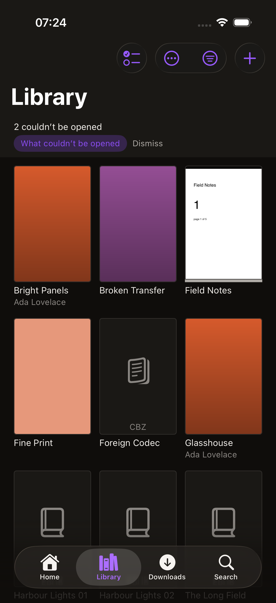
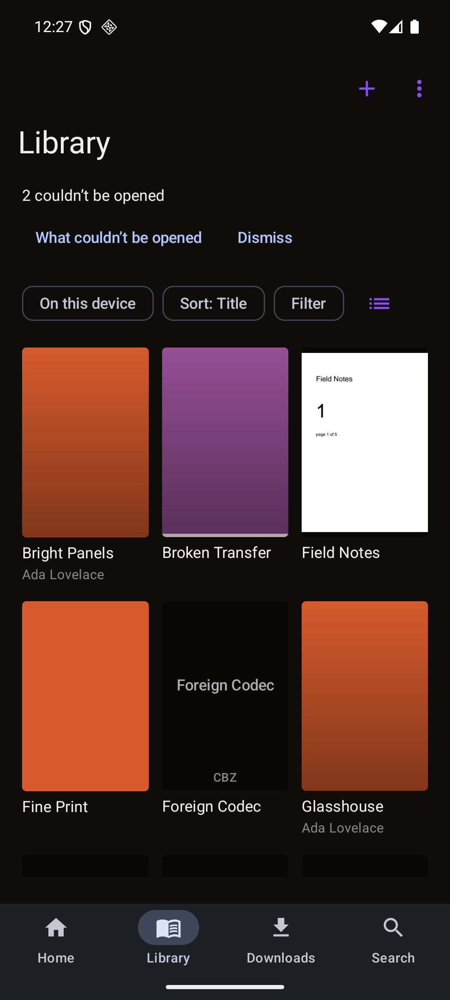
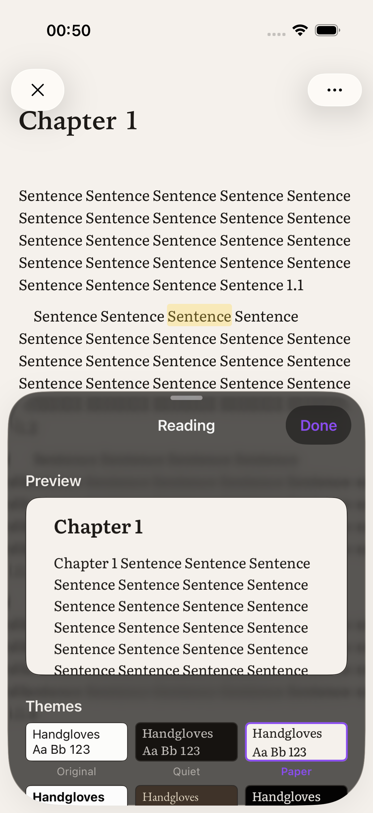
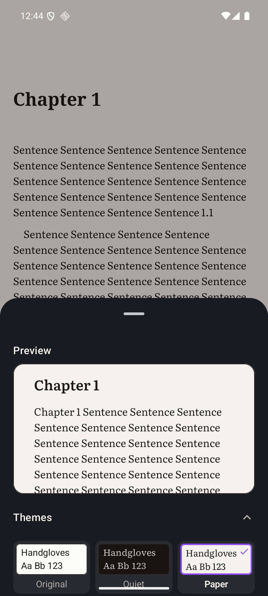

<div align="center">
<br />
<h1>StoryArc</h1>
<p><strong>Native comic, manga and ebook readers for iOS and Android.</strong></p>
<p>
<a href="https://github.com/me-cedric/StoryArc/actions/workflows/contract.yml"></a>
<a href="https://github.com/me-cedric/StoryArc/actions/workflows/ios.yml"></a>
<a href="https://github.com/me-cedric/StoryArc/actions/workflows/android.yml"></a>
<a href="LICENSE"></a>
</p>
<p>
<a href="https://swift.org"></a>
<a href="https://developer.apple.com/ios/"></a>
<a href="https://kotlinlang.org"></a>
<a href="https://developer.android.com"></a>
<a href="https://ko-fi.com/mecedric"></a>
</p>
<br />
</div>

<p align="center">
  
  &nbsp;&nbsp;
  
</p>

<p align="center">
  
  &nbsp;&nbsp;
  
</p>

<p align="center"><em>The same test library on both platforms — including the two files that
could not be opened, named rather than counted — and the reading-theme sheet on each: a live
preview above six presets, each drawn in its own colours <strong>and</strong> typeface. Both
pairs were taken by the capture harnesses in <code>scripts/</code>, not by hand; the same
sheets at the largest text size are in
<a href="docs/designs/screenshots/ios-theme-presets-2026-09-05/README.md">ios-theme-presets-2026-09-05</a>
and <code>android-sweep-2026-09-02</code>.</em></p>

StoryArc reads what you already own, from wherever you keep it: a folder on the
device, iCloud Drive or any Files provider, an SMB share on your NAS, an OPDS
catalogue, or a Kavita server. It caches what it finds, downloads what you ask
it to, remembers where you stopped, and syncs that back when the source can hold
it.

Two apps, written twice on purpose. iOS is Swift and SwiftUI with Liquid Glass.
Android is Kotlin and Compose with Material 3 Expressive. **No cross-platform UI
layer, ever** — the point is that each one feels like it shipped with the
operating system.

StoryArc is free and open source, with no paid tier, no accounts and no
telemetry. If it helps you, you can [support development on Ko-fi](https://ko-fi.com/mecedric).

---

## Status

**Pre-alpha, and further along than that word suggests.** Both apps open a
library from a folder, a share, a catalogue or a Kavita server, read comics and
EPUBs in their own readers, read aloud, and play audiobooks. What is missing is
finish, not surface: [`docs/openspec/STATUS.md`](docs/openspec/STATUS.md) scores
every one of the contract's 316 scenarios against both codebases — **149 built
and tested on both, 89 built and asserted by nothing, 16 on one platform only,
16 missing on both** — and every capability is `partial`. None is absent, none
is done, and a good deal of what compiles has been watched working by nobody
yet, which that document says row by row.

| Area | State |
| --- | --- |
| Capability specs | ✅ 17 capabilities, 316 scenarios, validating; every scenario audited against both apps with `path:line` evidence |
| Design system | ✅ OKLCH token source generating Swift + Kotlin, WCAG-gated in CI; the mark and every icon rendered from one SVG |
| Format layer | ✅ CBZ, CBR, CBT, PDF, EPUB and image folders open on both platforms — see below |
| Test corpus | ✅ 26 archives, 2 PDFs, 6 EPUBs and 7 audiobooks, one manifest, asserted by both suites |
| Sources | 🟡 Folders, SMB, OPDS and Kavita connect, cache and diagnose on both; `source-lifecycle` has 21 of 27 tasks ticked |
| Readers | 🟡 Paged comic reader and reflowable EPUB reader on both, six themes, four page transitions; `reader-theming-and-page-transitions` has 50 of 52 |
| Playback | 🟡 Read-aloud and an audiobook player on both, behind one session; `audiobooks-and-playback` has 33 of 37 and calls itself unfinished |
| Desktop | 📄 macOS, Windows and Linux documented; no code by design |

Tests: **1961 on iOS** across 248 host suites, plus 35 more in `StoryArcEpub`
that need a simulator; on Android, **2038 JVM plus 135 instrumented**, counted
from their `@Test` attributes. The instrumented ones exist because image
decoding, PDF rendering, Room and the RAR decoder cannot run on a host JVM.

Nothing here is installable yet. There are no releases and no signed builds.

### What the format layer actually does

| Format | State | How |
| --- | --- | --- |
| **CBZ** | ✅ Reads | Our own ranged-read ZIP reader ([ADR-0008]) — no dependency, and it recovers a truncated archive |
| **CBT** | ✅ Reads | Our own TAR reader — 512-byte headers need no library |
| **CBR** | ✅ Reads | Headers parsed by us; entries decompressed by [vendored libarchive](third_party/libarchive/VENDORING.md) |
| **PDF** | ✅ Reads | PDFKit on iOS, the platform's PDF module on Android. Selection, search and marks on both — on Android where the device's module has a text API, else it behaves like a scan; the document outline is iOS-only, because that module exposes none ([ADR-0012]) |
| **EPUB** | ✅ Reads | Package document parsed by us — EPUB 2 *and* 3, reflowable and fixed-layout — so metadata, contents and covers need no dependency. The text is rendered by Readium on both platforms, the one place HTML is allowed ([ADR-0001]) |
| **Image folder** | ✅ Reads | A directory of ordered images, same page rules as an archive |
| **Audiobook** | 🟡 Plays | M4B, M4A, MP3, FLAC and Ogg, or a folder of parts, sniffed from bytes; an `.aax` is refused by name. Specified by `audiobooks-and-playback`, which has not synced into the main specs yet |
| **CB7** | 🚫 Refused by name | Deferred, not refused for ever: [ADR-0013] costs out a 7-Zip decoder and settles the direction without the timing |

Two details worth knowing, because they shape everything above:

**A CBR is catalogued without being downloaded.** Page names, page count, sizes,
the cover, and whether the archive is solid all live in RAR headers, which carry
no compression — so they are read with ranged reads and no decoder. libarchive is
used for exactly one thing: turning a compressed entry's bytes into pixels' worth
of bytes. That is why only 26 of its 132 sources are vendored, pinned to one
upstream release — and a scheduled workflow raises a hand when upstream moves,
because copied sources are invisible to every dependency scanner.

**Solid RAR4 is refused, solid RAR5 is not.** The only RAR decoder with an
OSI-approved licence does not implement solid RAR4 at all, so downloading such a
file changes nothing and the app says so plainly. Solid RAR5 reads fine; it just
cannot be streamed.

## What it does

This is the contract, in prose. Most of it is built on both platforms;
[`STATUS.md`](docs/openspec/STATUS.md) says which sentence is asserted by a test,
which merely compiles, and which is still a promise.

**Sources** — Read from a device folder, iCloud Drive or any Files provider, an
SMB share, an OPDS catalogue, or a Kavita server. Every source caches locally,
so the library opens instantly and stays browsable when a server is unreachable.
Offline is a normal state, never an error.

**Formats** — CBZ, CBR, CBT, EPUB (reflowable and fixed-layout), PDF, and a plain
folder of images. Format is detected from content, not the extension, so a
mis-named file still opens. Metadata comes from `ComicInfo.xml`, the EPUB
package, or the filename — in that order. CB7 is refused by name rather than
half-supported. Audiobooks are arriving through `audiobooks-and-playback`.

**Reading** — A paged image reader with an interactive page curl that follows
your finger ([ADR-0009]), plus slide, fast fade, and continuous scroll for
webtoons. Right-to-left for manga, detected from metadata. Double-page spreads in
landscape. Chrome that hides itself and never reflows the page. A separate
reflowable reader for EPUB with **six named themes** — Original, Quiet, Paper,
Bold, Calm, Focus — and per-axis control over typeface, size, line, character,
word and paragraph spacing, margins, alignment and background colour, all with a
live preview. Bookmarks, highlights and read-aloud — the platform's own voices on
both sides ([ADR-0017]).

**Library** — One view over every source. Search, filter and sort — respecting a
reading list's curated order rather than forcing it alphabetical. Collections
and reading lists, local or server-backed, presented side by side.

**Offline** — Download a publication, a collection, or a whole reading list.
Resumable, background-capable, Wi-Fi-only if you want it, with visible storage
management and automatic cleanup after finishing.

**Progress** — Recorded locally first, always, and synced with Kavita in both
directions. The same book read from a folder and from a server resolves to one
record. Conflicts resolve to the furthest position, and finished stays finished.

**Everywhere** — English, French, German and Spanish, following your system by
default. System, Light, Dark, OLED Dark, plus a textured Natural theme. Dynamic
Type and font scale to maximum. VoiceOver
and TalkBack. Reduce Motion and Reduce Transparency respected, not ignored.

The full contract is in [`docs/openspec/specs/`](docs/openspec/specs) — 17 capabilities,
each written as user-observable behaviour with failure and offline paths.

## Repository layout

```
storyarc/
├── apps/
│   ├── ios/                       Swift · SwiftUI · XcodeGen · two SPM packages
│   ├── android/                   Kotlin · Compose · Gradle version catalog · 13 modules
│   ├── desktop-macos/             documented, not implemented
│   ├── desktop-windows/           documented, not implemented
│   └── desktop-linux/             documented, not implemented
├── packages/
│   ├── design-tokens/             OKLCH source → generated Swift + Kotlin
│   ├── test-fixtures/             one publication corpus, two test suites
│   ├── fonts/                     five OFL reading typefaces the EPUB reader bundles
│   └── licences/                  the inventory behind THIRD_PARTY_NOTICES.md
├── docs/
│   ├── openspec/
│   │   ├── project.md             product context
│   │   ├── specs/<capability>/    17 capability specs — the contract
│   │   ├── changes/               in-flight proposals, and archive/ for finished ones
│   │   └── STATUS.md              what is built against what is specified
│   ├── decisions/                 ADRs
│   ├── architecture/              layer model, repo map, where the hard problems are
│   ├── diagrams/                  a LikeC4 model: context, containers, components
│   ├── drawings/                  Mermaid, for the flows that earn a picture
│   ├── design.md                  the design system
│   ├── designs/                   the mark, and screenshots of what the apps look like
│   └── agent-compass/             the agent contract this repo imports — a submodule
├── third_party/
│   └── libarchive/                26 of 132 sources, for RAR only
└── scripts/                       the gates, the test library, the mock servers, the cameras
```

There is **no root build**. `apps/ios` builds with `xcodebuild`, `apps/android`
with `./gradlew`, and neither needs Node to compile. The workspace at the root is
the tooling around them: the spec and token gates, the fixture generator, a
library to test against with three servers to serve it, the screenshot
harnesses, and `pnpm check`, which runs all of it and then both apps' lint,
tests and test-target builds.

## Architecture

Two independent native codebases sharing three declarative artefacts and no code:

| Shared | Where | Enforced by |
| --- | --- | --- |
| Behaviour contract | `docs/openspec/specs/` | `pnpm spec:validate` and `pnpm spec:guard` in CI |
| Design tokens | `packages/design-tokens` | Generated into both apps; contrast gate in CI |
| Test fixtures | `packages/test-fixtures` | Both suites assert against the same corpus |
| Vendored C | `third_party/libarchive` | One copy, compiled by SwiftPM *and* by CMake |

The fourth row is the newest and the one that needed the most care. Two native
codebases sharing C sources is exactly the coupling ADR-0001 avoids everywhere
else, so it is allowed only because the alternative — two copies of a RAR
decoder — would drift, and because the sources are inert: 26 files, one
hand-written `config.h`, and a single entry point on each side. See
[VENDORING.md](third_party/libarchive/VENDORING.md).

Kotlin Multiplatform was the strongest alternative and was rejected for reasons
written down rather than assumed —
see [ADR-0001](docs/decisions/0001-independent-native-cores.md).

Both apps follow the same layering in their own idiom: a UI-free domain layer, a
design system, format and source layers, persistence, then feature modules. The
domain is UI-free specifically so the riskiest logic — the progress merge — is
testable on the host in milliseconds. Full map in
[`docs/architecture/`](docs/architecture/README.md).

### Decisions

| ADR | Decision |
| --- | --- |
| [0001](docs/decisions/0001-independent-native-cores.md) | Two independent native cores, not a shared one |
| [0002](docs/decisions/0002-monorepo-layout.md) | One repository for two independent apps |
| [0003](docs/decisions/0003-platform-floors.md) | iOS 26 and Android 12 as the minimum versions |
| [0004](docs/decisions/0004-desktop-strategy.md) | Desktop: documented now, built later |
| [0005](docs/decisions/0005-format-and-rendering-libraries.md) | Format and rendering libraries per platform *(proposed)* |
| [0006](docs/decisions/0006-progress-storage-and-sync.md) | Local-first progress with content-addressed identity |
| [0007](docs/decisions/0007-design-token-pipeline.md) | One OKLCH token source, generated into Swift and Kotlin |
| [0008](docs/decisions/0008-ranged-reads-and-own-zip-reader.md) | Ranged reads over a random-access source, with our own ZIP reader |
| [0009](docs/decisions/0009-page-curl-as-a-fragment-shader.md) | The page curl is a fragment shader over two decoded pages |
| [0010](docs/decisions/0010-smb-clients.md) | An SMB2 client per platform, both pure and permissively licensed |
| [0011](docs/decisions/0011-home-screen-widgets.md) | Home-screen widgets wait for a shared snapshot, and for a signing team *(deferral)* |
| [0012](docs/decisions/0012-pdf-text-on-android.md) | PDF text on Android comes from the platform's own PDF module |
| [0013](docs/decisions/0013-cb7-support.md) | CB7: what a 7-Zip decoder would cost, and three ways to answer it *(deferral)* |
| [0014](docs/decisions/0014-unpatchable-zip-in-the-readium-graph.md) | An unpatchable ZIP library ships in the iOS binary, and nothing calls it *(risk accepted)* |
| [0015](docs/decisions/0015-epub-webview-network-egress.md) | A publication's own network access: deny it, admit it, or narrow it |
| [0016](docs/decisions/0016-ios-smb-response-signing.md) | iOS SMB responses are unsigned and unverified — extends 0010 *(risk accepted)* |
| [0017](docs/decisions/0017-android-text-to-speech.md) | Android reads aloud with the platform engine, not a new Readium artifact |

New to the project? **0001 → 0002 → 0003.** The rest answer specific questions
when you reach them.

## Design

**Editorial darkroom.** The app is a room you read in. Chrome recedes,
auto-hides and never tints, so nothing competes with a page of artwork somebody
else drew.

- Neutrals carry a warm ink tilt rather than the clinical blue-grey most reader
  apps default to. Light theme is book stock, not office paper.
- The accent is a **violet from the middle of the app's own mark**, so the icon and
  the chrome cannot drift apart — not another blue, and not the tonal purple a
  Material baseline hands out. One value on every appearance: it clears 3:1 on
  book stock as well as on ink, which the mark's pink does not. Inside a
  publication it defers to a colour derived from the cover art.
- System sans for every piece of chrome, so the app reads as stock. A serif on
  publication titles is the whole of StoryArc's typographic voice — inside a
  book, five bundled OFL families carry the six reading themes.
- Spacing is deliberately uneven. A cover grid breathes; a metadata stack
  tightens. Uniform padding everywhere is the fastest way to look like a
  template.
- Comic covers keep a 4 pt radius. A comic cover is printed stock — rounding it
  like an app icon reads as wrong.

The **mark itself is generated too**, from one SVG. `pnpm brand:build` renders
twenty-four assets from it — per face an `.appiconset` for the icon and an
ordinary `.imageset` so the in-app chooser has something to draw, plus
`AccentColor.colorset`, the Android adaptive foreground and its monochrome twin,
and a plateless PNG for the docs. `pnpm brand:check` renders the same set and
fails if a byte differs, which is what stops a hand-edited icon. The accent hex
is read from the same token the apps read, so the icon and the chrome cannot
disagree.

Colour, type, spacing, radius and motion are authored once in OKLCH and
generated into Swift and Kotlin, so neither app can drift by hand-editing a hex
code. **Contrast is a build gate**: 58 pairs across five appearance ramps, with
text below its WCAG floor failing CI, and all six reading themes held to AAA
because that text is read for hours rather than glanced at. Both halves of a
pair are checked — an accent against its canvas *and* the label drawn on the
accent, because a gate that only checks one of those is checking half.

Full system in [`docs/design.md`](docs/design.md).

## Build from source

### Prerequisites

| For | Needs |
| --- | --- |
| iOS | macOS 26+, Xcode 26+, `brew install xcodegen swiftlint` |
| Android | JDK 21, Android SDK with platform 37 and build-tools |
| Contract, tokens and the harnesses | Node 22 or newer (`.nvmrc` says 24), pnpm 11, Python 3 for the fixture generator |

### Everything

```bash
git clone --recurse-submodules https://github.com/me-cedric/StoryArc.git
cd StoryArc
pnpm install
pnpm check          # the gates, then both apps' lint, tests and test-target builds
```

### iOS

```bash
cd apps/ios
xcodegen generate            # StoryArc.xcodeproj is generated, not committed
open StoryArc.xcodeproj
```

```bash
pnpm test:ios         # StoryArcKit on the host — fast loop, no simulator
pnpm test:ios:epub    # StoryArcEpub, which is iOS-only and needs one
pnpm build:ios:tests  # the UI tests — nothing else compiles them
```

### Android

Gradle needs a JDK 21 and the SDK, and neither is on the path by default on a
Mac: Homebrew's JDKs are keg-only, and `/usr/bin/java` is a stub that reports
"Unable to locate a Java Runtime". The `pnpm` scripts go through
`scripts/gradle.mjs`, which finds both and writes the gitignored
`apps/android/local.properties` a fresh checkout lacks:

```bash
pnpm lint:android && pnpm test:android    # or: pnpm gradle :feature:library:testDebugUnitTest
pnpm build:android:tests                  # the instrumented tests — nothing else compiles them
```

A bare `./gradlew` still needs both exported, because the wrapper needs a JVM
before it can read any property file:

```bash
export JAVA_HOME=$(/usr/libexec/java_home -v 21)
export ANDROID_HOME=${ANDROID_HOME:-$HOME/Library/Android/sdk}
cd apps/android && ./gradlew lint test assembleDebug
```

### Accessibility

`pnpm check` cannot see what a screen reader hears, so there is a second check for
that. With the app open on a connected device or emulator:

```bash
pnpm a11y:android   # reads the accessibility tree off the device
```

It reports an actionable control with no name, a name that is a raw value rather
than a description, and a target below 48dp. It found all three of those in screens
that looked correct in a screenshot.

Run it on every screen a change touches. It reads whatever is on screen at the
moment you run it, so navigate first. `pnpm smoke:android` walks the app's routes
and asks logcat whether the process died, and `pnpm pseudo:android` walks nine of
them under a pseudo-locale to find text that leaves its row.

### A library to test against

Nothing on a screenshot means much against an empty library, and a folder that only
one machine has is not a fixture. This writes one:

```bash
pnpm corpus ~/StoryArcCorpus     # or --simulator, into the booted app's Documents
```

It generates seventeen publications, one per format the app claims to read — CBZ,
CBT, a folder of images, reflowable and fixed-layout EPUB, and PDF — with a series
to exercise "next in series", pages large enough that a held zoom visibly
re-decodes them, a comic in a codec no device decodes, a half-copied one, and two
deliberately unreadable files that fail for different reasons, so two refusals
have two sentences. `--count 200` pads it into a long library, so sectioning has
something to section. `pnpm corpus:check` verifies the bytes it writes, and runs
as part of `pnpm check`.

### A catalogue to test against

`opds-catalog` cannot be verified from a screenshot of a parser. This serves the corpus
above as a real OPDS catalogue, so the whole walkthrough — type an address, get past a
sign-in, read a book — happens against a server:

```bash
pnpm opds ~/StoryArcCorpus       # port 4444 unless --port says otherwise
```

| Route | What it exercises |
| --- | --- |
| `/opds` | A navigation feed, OPDS 1.2 |
| `/opds/all`, `/opds/series` | An acquisition feed, paginated, with a language facet; a navigation feed of series |
| `/opds2` | The same catalogue as OPDS 2.0 JSON |
| `/private` | A 401 answered by Basic `ada` / `lovelace` |
| `/bearer` | A 401 answered by Bearer `storyarc-token` |
| `/page`, `/empty` | The two refusals the spec requires by name |
| `/files/<name>` | The publication itself, byte-ranged — and, on demand, ranged *badly*, the way a NAS sometimes does |
| `/redirect/<name>` | A 302 to the file, so a redirect mid-stream is reachable |
| `/flaky/…` | Fails twice with 503 then succeeds, so the retry-with-backoff can be watched |

There is a Kavita mock beside it, for the parts of `kavita-server` that OPDS cannot
express:

```bash
pnpm kavita ~/StoryArcCorpus
```

It answers on port 5000 with API key `storyarc-test-key`, reporting version 0.8.3, two
libraries and the corpus arranged as series and chapters. It is not a reimplementation of
Kavita — it is the shape of the endpoints StoryArc calls, so the walkthrough can be
watched. **StoryArc's Kavita client is built against Kavita's documented API and this
mock, not against a live server.** Anyone who points it at a real Kavita and finds a
difference should correct the mock as well as the client, so the next person inherits the
correction.

And a real SMB server, because `network-share` deserves a real one:

```bash
pnpm smb ~/StoryArcCorpus        # Samba on 4445, share "Comics", your user, password "lovelace"
pnpm smb --encrypted             # the same on 4446 with encryption required, to watch the refusal
```

It needs Homebrew's Samba. impacket was tried first and rejected: it derives its
signing key without NTLM key exchange, so every correct client refuses its answers
and the authenticated path could not be proved.

The simulator and the emulator both reach these: `http://localhost:4444/opds` on iOS, and
`http://10.0.2.2:4444/opds` from an Android emulator. iOS permits plain HTTP here
because `NSAllowsLocalNetworking` is set for self-hosted servers; a catalogue on the
public internet still has to be HTTPS.

### Photographing a screen

A change a reader can see owes a screenshot, and both platforms have a camera that
walks to the screen rather than photographing whatever happens to be in front of it:

```bash
pnpm capture:android --list                                          # the routes
pnpm capture:android Downloads --out shot.png --dark --font-scale 2.0   # one frame, and it puts the device back
pnpm capture:ios --out docs/designs/screenshots/after-x --appearance dark   # drives ScreenshotTests, lifts every frame out of the result bundle
```

`--out` is a file on Android and a directory on iOS, because one drives a route and
the other a whole UI-test walk. The Android one restores the font scale and the
appearance even when the capture fails, which is the part a person forgets.

## Contributing

[`docs/openspec/STATUS.md`](docs/openspec/STATUS.md) says how much of each specified
capability exists, scenario by scenario. Nothing is absent and nothing is finished:
all seventeen capabilities are `partial`, and `sources` is still the keystone —
five of the others wait on it. Nine changes are in flight and five are archived
under `docs/openspec/changes/`.

The rule that shapes everything else: **every behaviour is specified before it
is built.** If what you want to add is not in `docs/openspec/specs/`, propose it
first rather than implementing it and writing the spec afterwards.

The OpenSpec root is `docs/openspec`, so the CLI resolves it only from `docs/`.
Run `cd docs` first, or use the `pnpm spec:*` scripts, which do it for you.

```bash
pnpm openspec:workflows   # if your agent tooling is not set up yet
# then, in Claude Code / Codex / Gemini:
/opsx:propose "add support for <thing>"
```

Not `openspec init`: it writes the agent directories beside the root, and this root
is `docs/openspec` while `.claude/` and `.github/` are at the top. `pnpm
openspec:workflows` renders the same twelve workflows from the installed CLI's own
templates into the right place, and `pnpm lint` fails when they drift from it.
`/opsx:apply` implements an approved change; `/opsx:verify` reads the code against
the requirements before `/opsx:archive` retires it.

`pnpm spec:validate` checks that the artifacts a change has are well-formed.
`pnpm spec:guard` checks that it has the ones it should — the two are not the same
question, and a change holding only a proposal passes the first. `pnpm delta:drop`
and `pnpm partial:tasks`, both in `pnpm lint`, catch the two ways a change has
quietly deleted a requirement or announced itself finished here.

A change a user can see also owes a screenshot from a booted simulator or
emulator — a `#Preview` or `@Preview` is not proof. On Android it owes a clean
`pnpm a11y:android` on the screens it touched, for the same reason: a screenshot
shows what the screen looks like and says nothing about what it announces. Details in
[CONTRIBUTING.md](CONTRIBUTING.md) and [AGENTS.md](AGENTS.md).

## Privacy

StoryArc has no backend. There is no account, no analytics, no crash reporting
and no telemetry of any kind. Data leaves your device only to the servers you
configured yourself. Credentials go to the iOS Keychain or the Android encrypted
store, and are redacted from every log and diagnostic before the string leaves
memory. What a publication's own HTML may reach is decided in [ADR-0015], and
[SECURITY.md](SECURITY.md) says how to report a problem.

## Licence

[MIT](LICENSE).

## Author

Built by **Cédric Meyer** — [github.com/me-cedric](https://github.com/me-cedric).

StoryArc is completely free, with no paid tier and no advertising. If it is
useful to you, [a coffee on Ko-fi](https://ko-fi.com/mecedric) is always
appreciated and never required.

[ADR-0001]: docs/decisions/0001-independent-native-cores.md
[ADR-0008]: docs/decisions/0008-ranged-reads-and-own-zip-reader.md
[ADR-0009]: docs/decisions/0009-page-curl-as-a-fragment-shader.md
[ADR-0012]: docs/decisions/0012-pdf-text-on-android.md
[ADR-0013]: docs/decisions/0013-cb7-support.md
[ADR-0015]: docs/decisions/0015-epub-webview-network-egress.md
[ADR-0017]: docs/decisions/0017-android-text-to-speech.md
