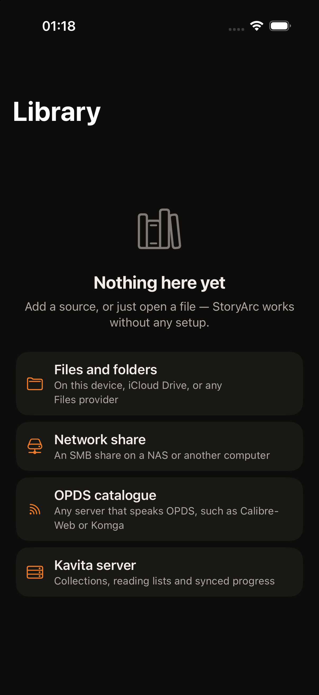
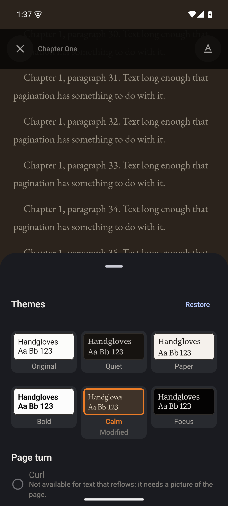
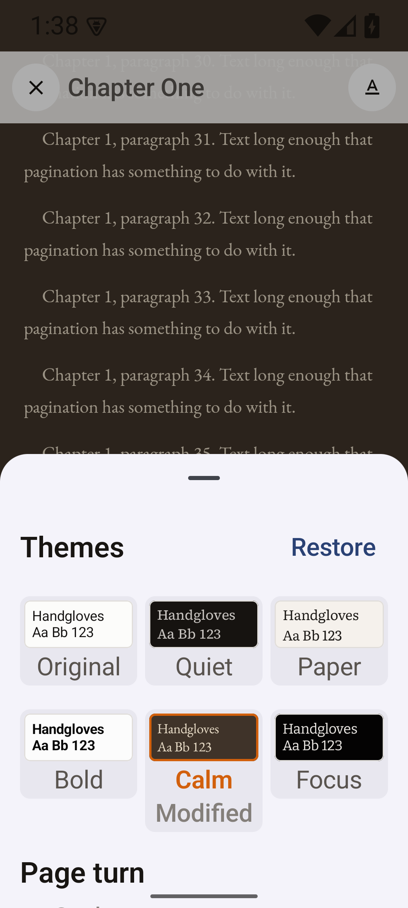

<div align="center">
<br />
<h1>StoryArc</h1>
<p><strong>Native comic, manga and ebook readers for iOS and Android.</strong></p>
<p>
<a href="https://github.com/me-cedric/StoryArc/actions/workflows/contract.yml"></a>
<a href="https://github.com/me-cedric/StoryArc/actions/workflows/ios.yml"></a>
<a href="https://github.com/me-cedric/StoryArc/actions/workflows/android.yml"></a>
<a href="LICENSE"></a>
</p>
<p>
<a href="https://swift.org"></a>
<a href="https://developer.apple.com/ios/"></a>
<a href="https://kotlinlang.org"></a>
<a href="https://developer.android.com"></a>
<a href="https://ko-fi.com/mecedric"></a>
</p>
<br />
</div>

<p align="center">
  
  &nbsp;&nbsp;
  
</p>

<p align="center">
  
  &nbsp;&nbsp;
  
</p>

<p align="center"><em>The reading-theme sheet — six presets previewed in their own
colours <strong>and</strong> typefaces, and the same sheet at twice the system text
size. The iOS pair is missing for a dull reason: the simulator accepts no injected
input, so the reader cannot be reached to open it.</em></p>

StoryArc reads what you already own, from wherever you keep it: a folder on the
device, iCloud Drive or any Files provider, an SMB share on your NAS, an OPDS
catalogue, or a Kavita server. It caches what it finds, downloads what you ask
it to, remembers where you stopped, and syncs that back when the source can hold
it.

Two apps, written twice on purpose. iOS is Swift and SwiftUI with Liquid Glass.
Android is Kotlin and Compose with Material 3 Expressive. **No cross-platform UI
layer, ever** — the point is that each one feels like it shipped with the
operating system.

StoryArc is free and open source, with no paid tier, no accounts and no
telemetry. If it helps you, you can [support development on Ko-fi](https://ko-fi.com/mecedric).

---

## Status

**Pre-alpha.** The format layer reads real files on both platforms; the reader UI
does not exist yet. So StoryArc can open your comics and count their pages — it
cannot yet show them to you.

| Area | State |
| --- | --- |
| Capability specs | ✅ 15 capabilities specified and validating |
| Design system | ✅ OKLCH token source generating Swift + Kotlin, WCAG-gated in CI |
| Format layer | ✅ CBZ, CBR, CBT, PDF and image folders open on both platforms — see below |
| Test corpus | ✅ 20 archives, 2 PDFs and 4 EPUBs, one manifest, asserted by both suites |
| Domain layer | 🟡 Sources, identity, progress and merge rules implemented and tested on both |
| EPUB | 🟡 Structure parses on both platforms; the reflowable reader is the next change |
| Source connectors | ⬜ Local, SMB, OPDS, Kavita — libraries chosen, not built |
| Readers | ⬜ Paged comic reader and reflowable ebook reader — specified, not built |
| Desktop | 📄 macOS, Windows and Linux documented; no code by design |

Tests: **145 on iOS** across 22 suites, **108 JVM plus 29 instrumented** on
Android. The instrumented ones exist because image decoding, PDF rendering and
the RAR decoder cannot run on a host JVM.

Nothing here is installable yet. There are no releases and no signed builds.

### What the format layer actually does

| Format | State | How |
| --- | --- | --- |
| **CBZ** | ✅ Reads | Our own ranged-read ZIP reader ([ADR-0008]) — no dependency, and it recovers a truncated archive |
| **CBT** | ✅ Reads | Our own TAR reader — 512-byte headers need no library |
| **CBR** | ✅ Reads | Headers parsed by us; entries decompressed by [vendored libarchive](third_party/libarchive/VENDORING.md) |
| **PDF** | ✅ Reads | PDFKit on iOS, `PdfRenderer` on Android. Text, search and outline are iOS-only, by design |
| **Image folder** | ✅ Reads | A directory of ordered images, same page rules as an archive |
| **CB7** | 🚫 Refused by name | Out of scope. Rare, and the worst streaming case |
| **EPUB** | 🟡 Indexes | Package document parsed by us — EPUB 2 *and* 3, reflowable and fixed-layout — so metadata, contents and covers need no dependency. *Rendering* reflowable text needs Readium, the next change |

Two details worth knowing, because they shape everything above:

**A CBR is catalogued without being downloaded.** Page names, page count, sizes,
the cover, and whether the archive is solid all live in RAR headers, which carry
no compression — so they are read with ranged reads and no decoder. libarchive is
used for exactly one thing: turning a compressed entry's bytes into pixels' worth
of bytes. That is why only 26 of its 132 sources are vendored, and why it adds
about 140 kB per Android ABI.

**Solid RAR4 is refused, solid RAR5 is not.** The only RAR decoder with an
OSI-approved licence does not implement solid RAR4 at all, so downloading such a
file changes nothing and the app says so plainly. Solid RAR5 reads fine; it just
cannot be streamed.

## What it will do

**Sources** — Read from a device folder, iCloud Drive or any Files provider, an
SMB share, an OPDS catalogue, or a Kavita server. Every source caches locally,
so the library opens instantly and stays browsable when a server is unreachable.
Offline is a normal state, never an error.

**Formats** — CBZ, CBR, CBT, EPUB (reflowable and fixed-layout), PDF, and a plain
folder of images. Format is detected from content, not the extension, so a
mis-named file still opens. Metadata comes from `ComicInfo.xml`, the EPUB
package, or the filename — in that order. CB7 is refused by name rather than
half-supported.

**Reading** — A paged image reader with an interactive page curl that follows
your finger, plus slide, fast fade, and continuous scroll for webtoons.
Right-to-left for manga, detected from metadata. Double-page spreads in
landscape. Chrome that hides itself and never reflows the page. A separate
reflowable reader for EPUB with **six named themes** — Original, Quiet, Paper,
Bold, Calm, Focus — and per-axis control over typeface, size, line, character,
word and paragraph spacing, margins, alignment and background colour, all with a
live preview. Bookmarks, highlights and read-aloud.

**Library** — One view over every source. Search, filter and sort — respecting a
reading list's curated order rather than forcing it alphabetical. Collections
and reading lists, local or server-backed, presented side by side.

**Offline** — Download a publication, a collection, or a whole reading list.
Resumable, background-capable, Wi-Fi-only if you want it, with visible storage
management and automatic cleanup after finishing.

**Progress** — Recorded locally first, always, and synced with Kavita in both
directions. The same book read from a folder and from a server resolves to one
record. Conflicts resolve to the furthest position, and finished stays finished.

**Everywhere** — English, French, German and Spanish, following your system by
default. System, Light, Dark, OLED Dark, plus a textured Natural theme. Dynamic
Type and font scale to maximum. VoiceOver
and TalkBack. Reduce Motion and Reduce Transparency respected, not ignored.

The full contract is in [`docs/openspec/specs/`](docs/openspec/specs) — 15 capabilities,
each written as user-observable behaviour with failure and offline paths.

## Repository layout

```
storyarc/
├── apps/
│   ├── ios/                       Swift · SwiftUI · XcodeGen · SPM
│   ├── android/                   Kotlin · Compose · Gradle version catalog
│   ├── desktop-macos/             documented, not implemented
│   ├── desktop-windows/           documented, not implemented
│   └── desktop-linux/             documented, not implemented
├── packages/
│   ├── design-tokens/             OKLCH source → generated Swift + Kotlin
│   └── test-fixtures/             one publication corpus, two test suites
├── docs/
│   ├── openspec/
│   │   ├── project.md             product context
│   │   ├── specs/<capability>/    15 capability specs — the contract
│   │   └── changes/               in-flight proposals
│   ├── decisions/                 ADRs
│   ├── architecture/              layer model and where the hard problems are
│   ├── design.md                  the design system
│   └── designs/screenshots/       what the apps actually look like
├── third_party/
│   └── libarchive/                26 of 132 sources, for RAR only
└── scripts/                       cross-cutting tooling
```

There is **no root build**. `apps/ios` builds with `xcodebuild`, `apps/android`
with `./gradlew`, and neither needs Node. The workspace at the root exists only
for the token pipeline and spec validation.

## Architecture

Two independent native codebases sharing three declarative artefacts and no code:

| Shared | Where | Enforced by |
| --- | --- | --- |
| Behaviour contract | `docs/openspec/specs/` | `pnpm spec:validate` in CI |
| Design tokens | `packages/design-tokens` | Generated into both apps; contrast gate in CI |
| Test fixtures | `packages/test-fixtures` | Both suites assert against the same corpus |
| Vendored C | `third_party/libarchive` | One copy, compiled by SwiftPM *and* by CMake |

The fourth row is the newest and the one that needed the most care. Two native
codebases sharing C sources is exactly the coupling ADR-0001 avoids everywhere
else, so it is allowed only because the alternative — two copies of a RAR
decoder — would drift, and because the sources are inert: 26 files, one
hand-written `config.h`, and a single entry point on each side. See
[VENDORING.md](third_party/libarchive/VENDORING.md).

Kotlin Multiplatform was the strongest alternative and was rejected for reasons
written down rather than assumed —
see [ADR-0001](docs/decisions/0001-independent-native-cores.md).

Both apps follow the same layering in their own idiom: a UI-free domain layer, a
design system, format and source layers, persistence, then feature modules. The
domain is UI-free specifically so the riskiest logic — the progress merge — is
testable on the host in milliseconds. Full map in
[`docs/architecture/`](docs/architecture/README.md).

### Decisions

| ADR | Decision |
| --- | --- |
| [0001](docs/decisions/0001-independent-native-cores.md) | Two independent native cores, not a shared one |
| [0002](docs/decisions/0002-monorepo-layout.md) | One repository for two independent apps |
| [0003](docs/decisions/0003-platform-floors.md) | iOS 26 and Android 12 as the minimum versions |
| [0004](docs/decisions/0004-desktop-strategy.md) | Desktop: documented now, built later |
| [0005](docs/decisions/0005-format-and-rendering-libraries.md) | Format and rendering libraries per platform *(proposed)* |
| [0006](docs/decisions/0006-progress-storage-and-sync.md) | Local-first progress with content-addressed identity |
| [0007](docs/decisions/0007-design-token-pipeline.md) | One OKLCH token source, generated into Swift and Kotlin |

## Design

**Editorial darkroom.** The app is a room you read in. Chrome recedes,
auto-hides and never tints, so nothing competes with a page of artwork somebody
else drew.

- Neutrals carry a warm ink tilt rather than the clinical blue-grey most reader
  apps default to. Light theme is book stock, not office paper.
- The accent is a **violet from the middle of the app's own mark**, so the icon and
  the chrome cannot drift apart — not another blue, and not the tonal purple a
  Material baseline hands out. One value on every appearance: it clears 3:1 on
  book stock as well as on ink, which the mark's pink does not. Inside a
  publication it defers to a colour derived from the cover art.
- System sans for every piece of chrome, so the app reads as stock. A serif on
  publication titles is the whole of StoryArc's typographic voice.
- Spacing is deliberately uneven. A cover grid breathes; a metadata stack
  tightens. Uniform padding everywhere is the fastest way to look like a
  template.
- Comic covers keep a 4 pt radius. A comic cover is printed stock — rounding it
  like an app icon reads as wrong.

The **mark itself is generated too**, from one SVG. `pnpm brand:build` renders
twenty-four assets from it — per face an `.appiconset` for the icon and an
ordinary `.imageset` so the in-app chooser has something to draw, plus
`AccentColor.colorset`, the Android adaptive foreground and its monochrome twin,
and a plateless PNG for the docs. `pnpm brand:check` renders the same set and
fails if a byte differs, which is what stops a hand-edited icon. The accent hex
is read from the same token the apps read, so the icon and the chrome cannot
disagree.

Colour, type, spacing, radius and motion are authored once in OKLCH and
generated into Swift and Kotlin, so neither app can drift by hand-editing a hex
code. **Contrast is a build gate**: 58 pairs across five appearance ramps, with
text below its WCAG floor failing CI, and all six reading themes held to AAA
because that text is read for hours rather than glanced at. Both halves of a
pair are checked — an accent against its canvas *and* the label drawn on the
accent, because a gate that only checks one of those is checking half.

Full system in [`docs/design.md`](docs/design.md).

## Build from source

### Prerequisites

| For | Needs |
| --- | --- |
| iOS | macOS 26+, Xcode 26+, `brew install xcodegen swiftlint` |
| Android | JDK 21, Android SDK with platform 37 and build-tools |
| Contract and tokens | Node 24, pnpm 11 |

### Everything

```bash
git clone --recurse-submodules https://github.com/me-cedric/StoryArc.git
cd StoryArc
pnpm install
pnpm check          # specs, tokens, both apps' lint and tests
```

### iOS

```bash
cd apps/ios
xcodegen generate            # StoryArc.xcodeproj is generated, not committed
open StoryArc.xcodeproj
```

```bash
cd apps/ios/Packages/StoryArcKit && swift test    # fast loop, no simulator
```

### Android

Gradle needs both of these on the environment. `pnpm check` shells out to Gradle, so it
fails with "Unable to locate a Java Runtime" if `JAVA_HOME` is unset — which is the error,
not a missing dependency:

```bash
export JAVA_HOME=$(/usr/libexec/java_home -v 21)
export ANDROID_HOME=${ANDROID_HOME:-$HOME/Library/Android/sdk}
```

```bash
cd apps/android
echo "sdk.dir=$ANDROID_HOME" > local.properties
./gradlew lint test assembleDebug
```

### Accessibility

`pnpm check` cannot see what a screen reader hears, so there is a second check for
that. With the app open on a connected device or emulator:

```bash
pnpm a11y:android   # reads the accessibility tree off the device
```

It reports an actionable control with no name, a name that is a raw value rather
than a description, and a target below 48dp. It found all three of those in screens
that looked correct in a screenshot.

Run it on every screen a change touches. It reads whatever is on screen at the
moment you run it, so navigate first.

### A library to test against

Nothing on a screenshot means much against an empty library, and a folder that only
one machine has is not a fixture. This writes one:

```bash
pnpm corpus ~/StoryArcCorpus     # or --simulator, into the booted app's Documents
```

It generates a publication per format the app claims to read — CBZ, CBT, a folder of
images, reflowable and fixed-layout EPUB, and PDF — plus a series to exercise "next in
series" and one deliberately unreadable file so the refusal path has something to
refuse. `pnpm corpus:check` verifies the bytes it writes, and runs as part of
`pnpm check`.

### A catalogue to test against

`opds-catalog` cannot be verified from a screenshot of a parser. This serves the corpus
above as a real OPDS catalogue, so the whole walkthrough — type an address, get past a
sign-in, read a book — happens against a server:

```bash
pnpm opds ~/StoryArcCorpus
```

| Route | What it exercises |
| --- | --- |
| `/opds` | A navigation feed, OPDS 1.2 |
| `/opds/all` | An acquisition feed, paginated, with a language facet |
| `/opds2` | The same catalogue as OPDS 2.0 JSON |
| `/private` | A 401 answered by Basic `ada` / `lovelace` |
| `/bearer` | A 401 answered by Bearer `storyarc-token` |
| `/page`, `/empty` | The two refusals the spec requires by name |
| `/flaky/…` | Fails twice with 503 then succeeds, so the retry-with-backoff can be watched |

There is a Kavita mock beside it, for the parts of `kavita-server` that OPDS cannot
express:

```bash
pnpm kavita ~/StoryArcCorpus
```

It answers on port 5000 with API key `storyarc-test-key`, reporting version 0.8.3, two
libraries and the corpus arranged as series and chapters. It is not a reimplementation of
Kavita — it is the shape of the endpoints StoryArc calls, so the walkthrough can be
watched. **StoryArc's Kavita client is built against Kavita's documented API and this
mock, not against a live server.** Anyone who points it at a real Kavita and finds a
difference should correct the mock as well as the client, so the next person inherits the
correction.

The simulator and the emulator both reach these: `http://localhost:4444/opds` on iOS, and
`http://10.0.2.2:4444/opds` from an Android emulator. iOS permits plain HTTP here
because `NSAllowsLocalNetworking` is set for self-hosted servers; a catalogue on the
public internet still has to be HTTPS.

## Contributing

[`docs/openspec/STATUS.md`](docs/openspec/STATUS.md) says how much of each specified
capability exists. Five capabilities are absent entirely, and `sources` is the keystone
four of them wait on.

The rule that shapes everything else: **every behaviour is specified before it
is built.** If what you want to add is not in `docs/openspec/specs/`, propose it
first rather than implementing it and writing the spec afterwards.

The OpenSpec root is `docs/openspec`, so the CLI resolves it only from `docs/`.
Run `cd docs` first, or use the `pnpm spec:*` scripts, which do it for you.

```bash
pnpm openspec:workflows   # if your agent tooling is not set up yet
# then, in Claude Code / Codex / Gemini:
/opsx:propose "add support for <thing>"
```

Not `openspec init`: it writes the agent directories beside the root, and this root
is `docs/openspec` while `.claude/` and `.github/` are at the top. `pnpm
openspec:workflows` renders the same twelve workflows from the installed CLI's own
templates into the right place, and `pnpm lint` fails when they drift from it.

`pnpm spec:validate` checks that the artifacts a change has are well-formed.
`pnpm spec:guard` checks that it has the ones it should — the two are not the same
question, and a change holding only a proposal passes the first.

A change a user can see also owes a screenshot from a booted simulator or
emulator — a `#Preview` or `@Preview` is not proof. On Android it owes a clean
`pnpm a11y:android` on the screens it touched, for the same reason: a screenshot
shows what the screen looks like and says nothing about what it announces. Details in
[CONTRIBUTING.md](CONTRIBUTING.md) and [AGENTS.md](AGENTS.md).

## Privacy

StoryArc has no backend. There is no account, no analytics, no crash reporting
and no telemetry of any kind. Data leaves your device only to the servers you
configured yourself. Credentials go to the iOS Keychain or the Android encrypted
store, and are redacted from every log and diagnostic before the string leaves
memory.

## Licence

[MIT](LICENSE).

## Author

Built by **Cédric Meyer** — [github.com/me-cedric](https://github.com/me-cedric).

StoryArc is completely free, with no paid tier and no advertising. If it is
useful to you, [a coffee on Ko-fi](https://ko-fi.com/mecedric) is always
appreciated and never required.

[ADR-0008]: docs/decisions/0008-ranged-reads-and-own-zip-reader.md
